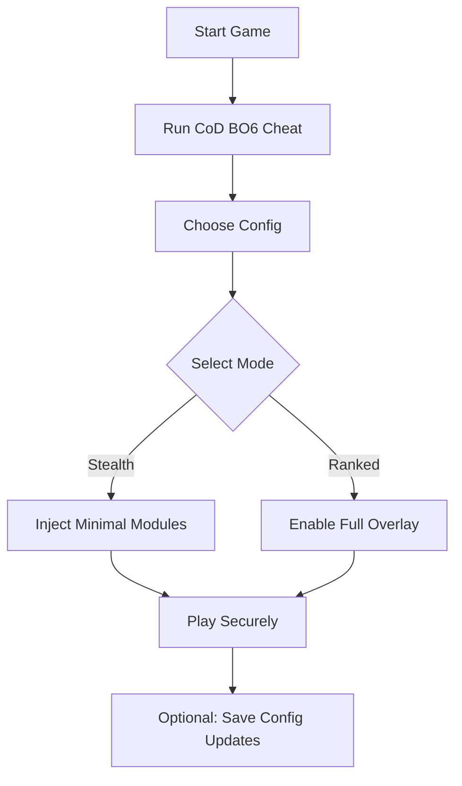

# CoD Black Ops 6 Cheat Software 🎯

**Dominate every match** with the new **CoD Black Ops 6 Cheat**, a powerful enhancement tool designed for precision targeting, deep map awareness, and fast configuration switching. Whether you play casually or in ranked lobbies, this pro-grade software brings unmatched tactical control and smart automation for your gameplay.

---

## 🧭 Overview

The **CoD Black Ops 6 Cheat Software** is an integrated enhancement engine built for **Call of Duty: Black Ops 6 (2025 release)**. It provides customizable precision modules such as:

* **Aim synchronization** with latency compensation.
* **Wall vision (ESP overlays)** for spatial awareness.
* **Radar pulse tracking** for dynamic enemy positioning.
* **Weapon-specific auto-adjustment** for recoil and bullet drop.

[!IMPORTANT]
Always run the tool **after launching the game** to prevent file conflict or false flag detection during patch scans.

---

## ⚙️ Key Features

### 🎯 Precision Targeting

* **Dynamic Aim Assist:** Locks to visible enemies only, respecting line-of-sight filters.
* **Smart Aim Zones:** Define your field of view — e.g., `FOV = 35°` for close quarters.
* **Head & Torso Bias:** Adjust ratios for safer or faster elimination logic.

### 👁 Visual Overlay (ESP)

* **Player Outlines:** Color-coded by team and distance.
* **Item & Armor ESP:** Identify tactical drops within 50–200m range.
* **Snaplines & Skeletons:** Visualize player movement direction for ambush setups.

### ⚡ Adaptive Config System

* Hot-swap between profiles:

  ```bash
  config_load stealth_mode.json
  config_load ranked_arena.json
  ```
* Store up to **10 configurations**, auto-detecting resolution scaling.
* Supports hotkeys (`ALT + 1–9`) for instant mode changes.

### 🧩 Injection Control

A lightweight **memory-safe injector** ensures that modules attach only to allowed instances, keeping your runtime stable and minimizing crash events.

---

## 💻 Compatibility

| Component             | Support                            | Notes                 |
| --------------------- | ---------------------------------- | --------------------- |
| **Game Version**      | CoD: Black Ops 6 (2025)            | Steam / Battle.net    |
| **OS**                | Windows 10 / 11                    | 64-bit only           |
| **GPU Compatibility** | NVIDIA, AMD, Intel ARC             | DX12 required         |
| **Overlay API**       | DirectX & Vulkan                   | Adjustable opacity    |
| **Accessibility**     | Configurable via UI or `.ini` file | Keyboard + Controller |

[!NOTE]
Full-screen and borderless modes are both supported, with automatic hook priority balancing.

---

## 🪛 Setup & Installation

Follow these steps for smooth configuration:

1. **Extract** the package into a new folder (avoid system drives).
2. **Launch CoD: BO6**, then open the cheat interface (`run_as_admin`).
3. Click **“Inject Modules”** once in the main menu.
4. Load your preferred preset (`default_assault.cfg`).
5. Press **F8** to toggle visibility in-game.

Example setup command:

```bash
blackops6_tool.exe --inject --profile=ranked_arena.cfg
```

---

### 🧠 Flow Diagram (Mermaid)



---

## ❓ FAQ

**Q1: Is the CoD Black Ops 6 Cheat detectable?**

> The injection method uses dynamic memory mapping and randomized signatures. While no tool can guarantee 100% safety, this system minimizes detection vectors during updates.

**Q2: Can I use it with a controller?**

> Yes. The software supports both keyboard/mouse and Xbox-compatible controllers, with adaptive aim scaling.

**Q3: Does it affect FPS performance?**

> Minimal — average impact is under 3% due to low-level overlay optimization.

**Q4: How often are configs updated?**

> Weekly updates match new game patches. You can also subscribe to the **Auto-Config Sync** channel for instant profile refresh.

**Q5: What’s included in the premium build?**

> Premium adds radar ESP radius expansion, stealth injection, and cloud config backup.

---

## 🏁 Final Thoughts

The **CoD Black Ops 6 Cheat Software** redefines tactical advantage for 2025’s most competitive shooter. Its precision-based modules, radar overlays, and adaptive injection framework offer **elite-level situational awareness** and customizable playstyles. Whether you’re focused on casual fun or pushing ranked leaderboards — this tool keeps you one step ahead.

---

